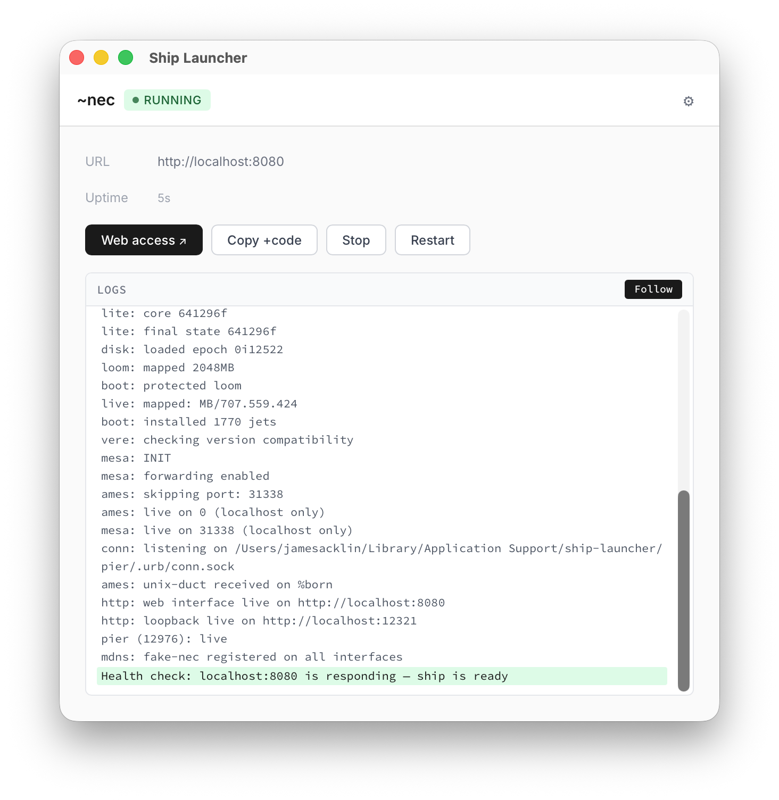

# Ship Launcher

A desktop application that wraps the Urbit runtime (`vere`) and a bundled pier into a single download-and-run experience. Built with [Tauri](https://tauri.app/), React, and TypeScript.



> **Note:** There are no pre-built downloads available yet. This app is intended to be built by Tlon Hosting's CI as one-off distributions — when a user exports a pier, the CI produces a ready-to-run executable bundling that pier. If you happen to have a pier archive (`.tar.zst` or `.tar.gz`) you'd like to run, you can also build the app yourself using the development instructions below.

## For Users

Ship Launcher packages an Urbit ship so you can run it like any other desktop app — once built, just install the `.app` (macOS) and double-click to start.

On first launch, the app automatically downloads the correct version of the Urbit runtime, extracts the bundled pier, and starts everything up. If the pier has a `.vere.txt` specifying a version, that exact version is fetched; otherwise the latest release is used. A dashboard shows your ship's status, recent logs, and controls to stop, restart, or retry booting if something goes wrong.

Once the ship is ready, click **Web access** to open your ship's web interface in a browser. You can copy your access `+code` from the main window.

### System tray

When you close the window, the app minimizes to the system tray instead of quitting. This keeps your ship running in the background. Right-click the tray icon for a menu with:

- **Show Interface** — brings the window back
- **Quit** — gracefully stops the ship and exits the app

### Troubleshooting

- **Error or crash on boot:** Click **Retry Boot** to restart the boot sequence. This preserves your ship's state.
- **Diagnostics:** Click the gear icon to view runtime details including the pier path, vere version, and process state.
- **Reveal data directory:** Use the diagnostics panel to open the app's data folder in Finder.
- **Logs:** The log panel at the bottom of the window shows real-time output from both the launcher and the Urbit runtime.

## Development

### Prerequisites

- [Node.js](https://nodejs.org/) (v18+)
- [pnpm](https://pnpm.io/)
- [Rust](https://rustup.rs/) (stable toolchain)
- [Tauri CLI](https://tauri.app/start/prerequisites/)

### Setup

```bash
pnpm install
```

### Running in dev mode

```bash
pnpm tauri dev
```

This starts the Vite dev server on `http://localhost:1420` and builds/launches the Tauri app with hot reload.

### Environment variables

All optional. Used to override bundled assets during development.

| Variable | Description |
|---|---|
| `SHIP_LAUNCHER_VERE_PATH` | Path to a `vere` binary. Skips auto-download when set |
| `SHIP_LAUNCHER_FAKE_SHIP` | Ship name for fake mode, e.g. `dev` or `bus`. Skips pier extraction and boots with `vere -F <name>` |
| `SHIP_LAUNCHER_DATA_DIR` | Override the app support directory (defaults to `~/Library/Application Support/ship-launcher`) |
| `SHIP_LAUNCHER_ARCHIVE_PATH` | Path to a `.tar.zst`, `.tar.gz`, or `.zip` pier archive |

#### Example: running a fake ~dev ship

Vere is downloaded automatically on first launch. To use a local binary instead:

```bash
SHIP_LAUNCHER_VERE_PATH=/path/to/vere SHIP_LAUNCHER_FAKE_SHIP=dev pnpm tauri dev
```

Without `SHIP_LAUNCHER_VERE_PATH`, the app downloads vere to `~/Library/Application Support/ship-launcher/bin/vere`:

```bash
SHIP_LAUNCHER_FAKE_SHIP=dev pnpm tauri dev
```

### Building for production

```bash
pnpm tauri build
```

The output is a standalone `.app` bundle (macOS) in `src-tauri/target/release/bundle/`.

The app downloads vere at runtime, so no binary needs to be bundled. To include a pier, place the pier archive and manifest in the Tauri resources directory and configure `tauri.conf.json` accordingly.

### Project structure

```
├── src/                    # React frontend
│   ├── App.tsx             # UI screens, status polling, controls
│   ├── App.css             # Styles
│   └── main.tsx            # Entry point
├── src-tauri/
│   ├── tauri.conf.json     # Tauri app config
│   ├── Cargo.toml
│   └── src/
│       ├── lib.rs          # Tauri commands and app lifecycle
│       ├── download.rs     # Automatic vere binary download
│       ├── runtime.rs      # Vere process supervision
│       ├── state.rs        # Launcher state machine
│       ├── extract.rs      # Pier archive extraction
│       ├── health.rs       # Ship readiness polling
│       ├── logs.rs         # Log capture and persistence
│       ├── paths.rs        # Platform path resolution
│       ├── version.rs      # Vere version compatibility
│       ├── pier.rs         # Pier structure validation
│       ├── bundle.rs       # Bundled asset discovery
│       ├── lock.rs         # Single-instance guard
│       ├── click.rs        # Login code retrieval
│       └── errors.rs       # Error types
├── docs/
│   └── screenshot.png      # App screenshot
├── tasks/
│   └── prd-launcher.md     # Product requirements
└── package.json
```

### Architecture

The app follows a state-machine-driven architecture:

```
Uninitialized → Extracting → Prepared → Starting → Running
                                  ↑                    ↓
                            Retry Boot            Stopping → Stopped
                                  ↑                    ↓
                                Error              Crashed
```

- **State machine** (`state.rs`): Enforces valid lifecycle transitions.
- **Runtime manager** (`runtime.rs`): Spawns and supervises the vere child process, captures stdout/stderr, handles graceful shutdown via SIGTERM.
- **Health checker** (`health.rs`): Polls `127.0.0.1:8080` every 2 seconds until the ship responds.
- **Frontend** (`App.tsx`): Polls `get_status` every second and renders the appropriate screen for each state.
